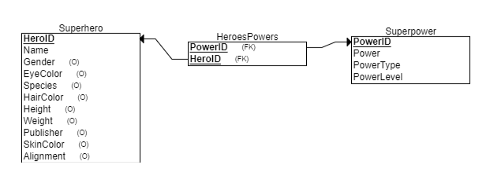

# ISYS 5713 Group 3 Project 
 ISYS 5713 Group 3 Project 
 An applicatio that will allow users to look up superheros and see the powers and power levels asscoaited with them, compare superheroes powers and allow uusers to create their own superheros

## Entity Diagram

## Data Dictionary

| Table | Attribute | Type | Description |
| --- | --- | --- | --- |
| **Superhero** | HeroId | INT | **Primary Key** |
| Superhero | Name | VARCHAR | Name of the character |
| Superhero | Gender | VARCHAR | Categorical |
| Superhero | EyeColor | VARCHAR | Categorical |
| Superhero | Species | VARCHAR | Categorical, E.g. Human, Android, Planet |
| Superhero | HairColor | VARCHAR | Categorical |
| Superhero | Height | INT | Height in inches (?) |
| Superhero | Weight | INT | Weight in pounds (?) |
| Superhero | Publisher | VARCHAR | Categorical |
| Superhero | SkinColor | VARCHAR | Categorical |
| Superhero | Alignment | VARCHAR | Categorical: Good, Bad, Neutral |
| | | | |
| **Superpower** | PowerId | INT | **Primary Key** |
| Superpower | Power | VARCHAR | Name of the power |
| Superpower | PowerType | VARCHAR | Categorical: E.g. Physical Enhancements, Energy Manipulation, Skills and Mastery |
| Superpower | PowerLevel | INT | Relative power level, 1-10 |
| | | | |
| **HeroesPowers** | HeroId | INT | **Composite Primary Key**, **Foreign Key** |
| HeroesPowers | PowerId | INT | **Composite Primary Key**, **Foreign Key** |

## Data Source
https://www.kaggle.com/datasets/claudiodavi/superhero-set  
Accessed October 2023