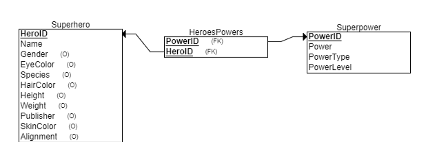

# "Who Would Win in a Fight?"
*ISYS 5713 Group 3 Project - Fall 2023*  
An application that will allow users to look up superheroes and see the powers and power levels associated with them, compare superheroes powers and allow users to create their own superheroes.

#### Table of Contents
1. [Frontend Interface](#frontend-interface)
1. [Configuration](#configuration)  
1. [API Endpoints](#api-endpoints)
    - [***Interactive Examples (Postman)***](https://warped-crescent-504561.postman.co/workspace/ISYS-5713-Group-3-Project-~b8905e7d-bbcd-44af-b741-a51fd722e32f/collection/30949789-d70169e9-e896-49f1-9826-4670d339dd59?action=share&creator=30949789)
    - Configuration Endpoints
        - [`/config/reset_database`: Reset the database](#configreset_database)
    - Data Endpoints
        - `/heroes`  
        [Get all heroes](#heroes)  
        [Create a new hero](#post_hero)  
        - `heroes/{id}`  
        [Return a hero by id](#heroesid)  
        [Update a hero](#put_hero)  
        [Delete a hero](#delete_hero)
        - `powers`  
        [Get all powers](#powers)
        - `powers/{id}`  
        [Get a power by id](#powersid)  
        - `heroes/{id}/powers`  
        [Get powers for a hero by id](#heroesidpowers)
    - Analysis Endpoints
        - `compare_powers`  
        [**KAPOW! ZAP! WHAM!** Who Would Win in a Fight??](#compare_powers)
1. [Data Information](#data-information)

# Frontend Interface
*Details on our frontend interface, once created, will be housed here.*

# Configuration
#### Backend configuration
- Requires Python 3.x
- After copying files to your directory, set up your python environment: `pip install requirements.txt`
- The API runs from the `api.py` file.

#### Frontend configuration
- As this API is not currently hosted on any public server, you will need to run it in your own environment or elsewhere in order to use it. (Refer to backend configuration instructions above.)
- In case the working database is not set up or has been changed, the API method [`/config/reset_database` - `PUT`](#configreset_database) can be run on first use or as needed.

# API Endpoints
[***Interactive Examples (Postman)***](https://warped-crescent-504561.postman.co/workspace/ISYS-5713-Group-3-Project-~b8905e7d-bbcd-44af-b741-a51fd722e32f/collection/30949789-d70169e9-e896-49f1-9826-4670d339dd59?action=share&creator=30949789)

The API supports the following endpoints:

## Configuration Endpoints

### `/config/reset_database`

|METHOD|`PUT`|
|---|---|
|**Description**|Resets the database to the original data.|
|**Parameters**|`reset_schema` *(optional)* - if True, the database schema will be recreated; if False, only the data contents will be reset. Default value is False.|

#### Example Request
http://localhost:5000/config/reset_database

#### Example Response
```json
{
    "message": "The database was successfully reset to the original state."
}
```
```json
{
    "error": "An error occurred while resetting the database. The database has not been reset."
}
```

## Data Endpoints

### `/heroes`

<span id="get_heroes"></span>

|METHOD|`GET`|
|---|---|
|**Description**|Returns all heroes.|
|**Parameters**|`limit` *(optional)* - limit number of heroes returned (defaults to 10)|

#### Example Request
http://localhost:5000/config/heroes?limit=2

#### Example Response
```json
[
    {
        "alignment": "good",
        "eye_color": "yellow",
        "gender": "Male",
        "hair_color": "No Hair",
        "height": 203.0,
        "hero_id": 1,
        "hero_name": "A-Bomb",
        "publisher": "Marvel Comics",
        "skin_color": "",
        "species": "Human",
        "weight": 441.0
    },
    {
        "alignment": "good",
        "eye_color": "blue",
        "gender": "Male",
        "hair_color": "No Hair",
        "height": 191.0,
        "hero_id": 2,
        "hero_name": "Abe Sapien",
        "publisher": "Dark Horse Comics",
        "skin_color": "blue",
        "species": "Icthyo Sapien",
        "weight": 65.0
    }
]
```

<span id="post_hero"></span>

|METHOD|`POST`|
|---|---|
|**Description**|Creates a new hero. Returns hero_id if successful.|
|**Body**|Takes a json object with attributes: `hero_name` ***(required)***, `gender`, `eye_color`, `species`, `hair_color`, `height`, `weight`, `publisher`, `skin_color`, `alignment`|

#### Example Request & Body
http://localhost:5000/heroes

```json
{
    "hero_name": "Spider-Man",
    "gender": "Male",
    "eye_color": "Hazel",
    "species": "Human",
    "hair_color": "Brown",
    "height": 178.0,
    "weight": 76.0,
    "publisher": "Marvel Comics",
    "skin_color": "Fair",
    "alignment": "Good"
}
```

#### Example Response
```json
{
    "hero_id": 735,
    "message": "Hero added successfully"
}
```

-----------------
### `/heroes/{id}`

<span id="get_hero"></span>

|METHOD|`GET`|
|---|---|
|**Description**|Returns a specific hero by id.|
|**Parameters / Body**|-|

#### Example Request
http://localhost:5000/heroes/36

#### Example Response
```json
{
    "alignment": "good",
    "eye_color": "blue",
    "gender": "Male",
    "hair_color": "Blond",
    "height": -99.0,
    "hero_id": 36,
    "hero_name": "Aquababy",
    "publisher": "DC Comics",
    "skin_color": "",
    "species": "",
    "weight": -99.0
}
```

<span id="put_hero"></span>

|METHOD|`PUT`|
|---|---|
|**Description**|Modifies the attributes of a hero by id. Returns updated hero details if successful.|
|**Body**|Takes a json object with attributes: `hero_name`, `gender`, `eye_color`, `species`, `hair_color`, `height`, `weight`, `publisher`, `skin_color`, `alignment`|

#### Example Request & Body
http://localhost:5000/heroes/735

```json
{
    "height": 30,
    "species": "Atlantean-Alien"
}
```

### Example Response
```json
{
    "hero": {
        "alignment": "good",
        "eye_color": "blue",
        "gender": "Male",
        "hair_color": "Blond",
        "height": 30.0,
        "hero_id": 36,
        "hero_name": "Aquababy",
        "publisher": "DC Comics",
        "skin_color": "",
        "species": "Atlantean-Alien",
        "weight": -99.0
    },
    "message": "Hero updated successfully"
}
```

<span id="delete_hero"></span>

|METHOD|`DELETE`|
|---|---|
|**Description**|Deletes a hero by id.|
|**Parameters**|-|

#### Example Request
http://localhost:5000/heroes/735

#### Example Response
```json
{
    "message": "Hero deleted successfully"
}
```

-----------------
### `/powers`

<span id="get_powers"></span>

|METHOD|`GET`|
|---|---|
|**Description**|Returns all powers.|
|**Parameters**|`limit` *(optional)* - limit number of heroes returned (defaults to 10)|

#### Example Request
http://localhost:5000/powers

#### Example Response
```json
[
    {
        "power_id": 1,
        "power_level": 7,
        "power_name": "Agility",
        "power_type": "Physical Enhancements"
    },
    {
        "power_id": 2,
        "power_level": 6,
        "power_name": "Accelerated Healing",
        "power_type": "Physical Enhancements"
    },
    ...
    {
        "power_id": 10,
        "power_level": 8,
        "power_name": "Danger Sense",
        "power_type": "Sensory/Perception Powers"
    }
]
```

-----------------
### `/powers/{id}`

<span id="get_power"></span>

|METHOD|`GET`|
|---|---|
|**Description**|Get a power by id.|
|**Parameters / Body**|-|

#### Example Request
http://localhost:5000/powers/2

#### Example Response
```json
{
    "power_id": 2,
    "power_level": "Physical Enhancements",
    "power_name": "Accelerated Healing",
    "power_type": 6
}
```

-----------------
### `/heroes/{id}/powers`


<span id="get_hero_powers"></span>

|METHOD|`GET`|
|---|---|
|**Description**|Returns the list of powers for the specified hero.|
|**Parameters / Body**|-|

#### Example Request & Body
http://localhost:5000/heroes/36/powers

#### Example Response
```json
[
    {
        "power_id": 11,
        "power_level": 7,
        "power_name": "Underwater breathing",
        "power_type": "Stealth and Survival Powers"
    },
    {
        "power_id": 18,
        "power_level": 9,
        "power_name": "Super Strength",
        "power_type": "Physical Enhancements"
    },
    {
        "power_id": 117,
        "power_level": 4,
        "power_name": "Water Control",
        "power_type": "Energy Manipulation"
    }
]
```

-----------------
### `/compare_powers`


<span id="compare_powers"></span>

|METHOD|`GET`|
|---|---|
|**Description**|Compares the powers of two heroes specified and returns the winner of the fight.|
|**Parameters**|`hero_id1`, `hero_id2` ***(both required)*** - ids of the heroes to fight. |

#### Example Request
http://localhost:5000/compare_power?hero_id1=57&hero_id2=105

#### Example Response
```json
{
    "hero_id1": "57",
    "hero_id2": "105",
    "hero_name1": "Azazel",
    "hero_name2": "Black Manta",
    "total_power1": 576,
    "total_power2": 660,
    "winner": "Black Manta"
}
```

# Data Information

## Entity Diagram


## Data Dictionary

| Table | Attribute | Type | Description |
| --- | --- | --- | --- |
| **Superhero** | HeroId | INT | **Primary Key** |
| Superhero | Name | VARCHAR | Name of the character |
| Superhero | Gender | VARCHAR | Categorical |
| Superhero | EyeColor | VARCHAR | Categorical |
| Superhero | Species | VARCHAR | Categorical, E.g. Human, Android, Planet |
| Superhero | HairColor | VARCHAR | Categorical |
| Superhero | Height | INT | Height in inches (?) |
| Superhero | Weight | INT | Weight in pounds (?) |
| Superhero | Publisher | VARCHAR | Categorical |
| Superhero | SkinColor | VARCHAR | Categorical |
| Superhero | Alignment | VARCHAR | Categorical: Good, Bad, Neutral |
| | | | |
| **Superpower** | PowerId | INT | **Primary Key** |
| Superpower | Power | VARCHAR | Name of the power |
| Superpower | PowerType | VARCHAR | Categorical: E.g. Physical Enhancements, Energy Manipulation, Skills and Mastery |
| Superpower | PowerLevel | INT | Relative power level, 1-10 |
| | | | |
| **HeroesPowers** | HeroId | INT | **Composite Primary Key**, **Foreign Key** |
| HeroesPowers | PowerId | INT | **Composite Primary Key**, **Foreign Key** |

## Data Source
https://www.kaggle.com/datasets/claudiodavi/superhero-set  
Accessed October 2023